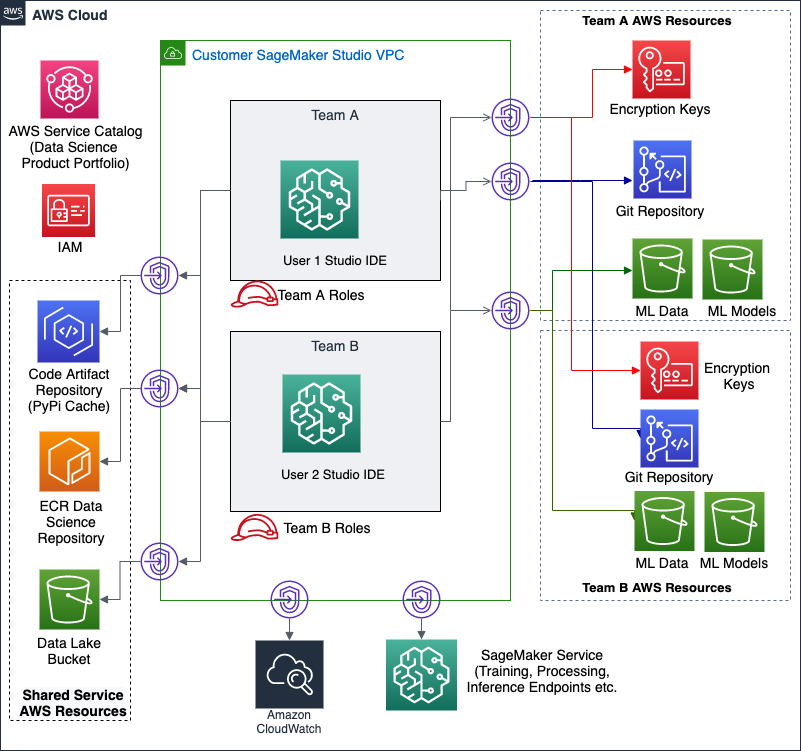
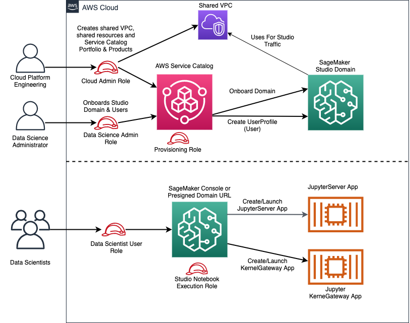

# Secure Data Science With Amazon SageMaker Studio Reference Architecture

## Overview

Amazon SageMaker is a powerful enabler and a key component of a data science environment, but it’s only part of what is required to build a complete and secure data science environment. For more robust security you will need other AWS services such as Amazon CloudWatch, Amazon S3, and AWS VPC. This project aims to be an example of how to pull together these services, to use them together to create secure, self-service, data science environments.

## Table of Contents

  1. [Repository Breakdown](#repository-breakdown)
  1. [Architecture and Process Overview](#architecture-and-process-overview)
  1. [Getting Started](#getting-started)
  1. [Features](#features)

      * [Private Network per Data Science Environment](#private-network-per-data-science-environment)
      * [Authentication and Authorization](#authentication-and-authorization)
      * [Data Protection](#data-protection)
      * [Auditability](#auditability)

  1. [Further Reading](#further-reading)
  1. [License](#license)

## Repository Breakdown

This repository contains the following files:

```bash
├── code_artifact_login.sh                  # Bash shell script to obtain a new AWS CodeArtifact token to install pre-approved pip packages
├── CODE_OF_CONDUCT.md                      # Guidance for participating in this open source project
├── CONTRIBUTING.md                         # Guidelines for contributing to this project
├── create-presigned-url.sh                 # Bash shell script to create pre-signed url for a user
├── install_code_artifact_pip_packages.sh   # Bash shell script to install pre-approved pip packages
├── LICENSE                                 # Details for the MIT-0 license
├── publish_cloudformation.sh               # Bash shell script to package and prepare CloudFormation for deployment
├── pre-signedurl-input.json                # AWS cli input json for use with create-presigned-url.sh
├── README.md                               # This readme
├── cloudformation
│   ├── ds_admin_detective.yaml             # Deploys a detective control to manage SageMaker resources
│   ├── ds_admin_principals.yaml            # Deploys the Data Science Administrator role
│   ├── ds_administration.yaml              # Deploys nested stacks
│   ├── ds_env_backing_store.yaml           # Deploys a team's S3 buckets and CodeCommit repository
│   ├── ds_env_principals.yaml              # Creates a data science administrator and user
│   ├── ds_env_sagemaker_studio.yaml        # Onboards the SageMaker Studio domain in a VPC
│   ├── ds_env_studio_user_profile_v1.yaml  # Onboards a SageMaker Studio domain user profile for a team
│   ├── ds_env_studio_user_profile_v2.yaml  # Onboards a SageMaker Studio domain user profile for a team with preventative control
│   ├── ds_environment.yaml                 # Manages nested stacks for a team
│   ├── ds_shared_code_artifact.yaml        # Creates shared CodeArtifact repository for the data science environment
│   ├── ds_shared_ecr.yaml                  # Creates shared ECR repository for the data science environment
│   └── ds_shared_sagemaker_network.yaml    # Creates a shared services VPC with private subnets and no Internet access
├── customimage
│   └── jupyter-docker-stacks-tensorflow           # SageMaker custom image tensforflow 2.4.1 built with Jupyter docker stacks
│   │   ├── app-image-config-input.json            # AWS cli input json for use with create-and-attach-image.sh
│   │   ├── build-publish-sm-docker-image.sh       # Bash shell script to build the custom image, publish to ECR
│   │   ├── create-and-attach-image.sh             # Bash shell script to build the custom image, publish to ECR and attach to a SageMaker Studio domain
│   │   ├── Dockerfile                             # Docker file for custom image
│   │   └── update-domain-input.json               # AWS cli input json for use with create-and-attach-image.sh
│   └── tensorflow25                         # SageMaker custom image tensforflow 2.5.0 built with official Tensorflow docker image
│   │   ├── app-image-config-input.json            # AWS cli input json for use with create-and-attach-image.sh
│   │   ├── build-publish-sm-docker-image.sh       # Bash shell script to build the custom image, publish to ECR
│   │   ├── create-and-attach-image.sh             # Bash shell script to build the custom image, publish to ECR and attach to a SageMaker Studio domain
│   │   ├── Dockerfile                             # Docker file for custom image
│   │   └── update-domain-input.json               # AWS cli input json for use with create-and-attach-image.sh
│   ├── code-artifact-login.sh              # Bash shell script to obtain a new AWS CodeArtifact token inside SageMaker Studio docker image
│   ├── setup-ds-env.sh                     # Bash shell script to setup data science environment inside SageMaker Studio docker image
├── docs
│   └── images
│       └── hla.png                         # High Level Architecture diagram
└── src
    ├── detective_control
    │   └── inspect_sagemaker_resource.py   # Lambda function to detect non-VPC-attached SageMaker resources
    └── project_template
        ├── 00_SageMaker-SysOps-Workflow.ipynb          # Sample Jupyter notebbok to demonstrate security controls
        ├── 01_SageMaker-DataScientist-Workflow.ipynb   # Sample Jupyter notebook to demonstrate secure ML lifecycle
        ├── 02_SageMaker-DevOps-Workflow.ipynb          # Second half of a secure ML lifecycle
        ├── util
            ├── __init__.py
            └── utilsspec.py
```

## Architecture and Process Overview



The diagram represents high level architecture of the secure data science environment provisioned by the CloudFormation templates in 
this project.  

Once deployed, this CloudFormation stack provides you with a Data Science Product Portfolio, powered by [AWS Service Catalog](https://aws.amazon.com/servicecatalog/). 
This allows users who have assumed the *Data Science Administrator* role to onboard SageMaker Studio domain using the
*SageMaker Studio Product*, deploy new data science environments using the *Data Science Team Environment* product and onboard
new users to the SageMaker Studio domain for a data science team using *Data Science Studio User Profile* product within 
the catalog. Note that the SageMaker Studio domain is onboarded only once in a region in an AWS Account.  

Data Science Administrators can onboard SageMaker Studio only with [network access type](https://docs.aws.amazon.com/sagemaker/latest/dg/onboard-vpc.html) 
**VPC only** by specifying Studio domain name, and custom SageMaker image properties.
AWS Service Catalog will then onboard SageMaker Studio to the shared service VPC:
- A private, isolated, dedicated network environment built using an [Amazon VPC](https://aws.amazon.com/vpc/).
- [Private connectivity](https://aws.amazon.com/privatelink/) to specific AWS services such as AWS CodeArtifact, AWS ECR, AWS KMS,
  Amazon S3, SageMaker services, AWS CodeCommit to name a few. Since SageMaker Studio is onboarded in a VPCOnly mode, it is required to
  use VPC Interface Endpoints to access AWS services.

Data Science Administrators can specify a team name, the environment type, and a few other criteria to launch the data science environment.  AWS Service Catalog
will then create a data science team environment consisting of:

- Private, dedicated [Amazon S3 buckets](https://aws.amazon.com/s3/) for a team's data and intellectual property
- A team Git repository hosted by [AWS CodeCommit](https://aws.amazon.com/codecommit/)
- Team-specific encryption keys managed by [AWS Key Management Service (KMS)](https://aws.amazon.com/kms/)
- Dedicated [AWS Identity & Access Management (IAM)](https://aws.amazon.com/iam/) roles for team resources
- A team-specific product portfolio so team members can provision resources for themselves

To use the environment, a data science team members can assume the *Data Science Administrator* role or the *Data Scientist User* role.  
Once they have assumed a Data Science Administrator role users can provision resources within the data science environment.  
Similarly once a user has assumed Data Science user role, by visiting the SageMaker service console within AWS Console
they can launch Amazon SageMaker Studio IDE and launch Studio notebook from the Studio IDE.

SageMaker Studio will start an Amazon SageMaker Studio-powered Jupyter notebook app.  This will produce a Studio Jupyter notebook app with:

- A KMS-encrypted Amazon S3 buckets
- An IAM role associated with the notebook instance which represents the intersection of user, notebook instance, and a team
- The Studio notebook apps are access AWS resources using the VPC Interface Endpoints configured for Studio VPC
- User access to `root` permissions is disabled by SageMaker Studio
- Studio notebook instance has no access to network resources outside of the Studio VPC
- A convenience Python module generated with constants defined for AWS KMS key IDs, VPC Subnet IDs, and Security Group IDs is placed in a
  custom SageMaker docker image to setup data science for all SageMaker images (prebuilt or custom)
  
## Getting Started

#### Prerequisites

1. An [AWS Account](https://aws.amazon.com/).
1. An AWS user with Admin role (with `AdministratorAccess` policy attached).
1. [AWS CLI](https://aws.amazon.com/cli/) is installed on your developer machine.
1. [Docker CLI](https://docs.docker.com/get-docker/) is installed on your developer machine.
1. [Git CLI]() is installed on your developer machine.
1. Access to [Docker Hub](https://hub.docker.com/).
1. Unix like environment - Linux or MacOS.

We recommend that you use [AWS Cloud9](https://aws.amazon.com/cloud9/) as it will get you going fastest with all the tools 
preinstalled. Cloud9 is a cloud-based integrated development environment (IDE) that lets you write, run, and debug your 
code with just a browser. It includes a code editor, debugger, and terminal. Cloud9 comes prepackaged with essential tools 
for development and includes AWS CLI, docker, git and much more. Cloud9 runs on an Amazon EC2 instance with Amazon Linux 2 
by default.

This project builds custom SageMaker Studio images and requires access to [docker hub](https://hub.docker.com/) in order 
to build custom docker images.

#### Step 1, as yourself with AWS Administrator Role as part of Cloud Platform Engineering team

Assuming you are signed into the AWS console with `Admin` role, follow instructions to [setup Cloud9](https://docs.aws.amazon.com/cloud9/latest/user-guide/setting-up.html) 
as an `Individual User` by accepting all defaults. Launch Cloud9 IDE by [clicking on Open IDE](https://docs.aws.amazon.com/cloud9/latest/user-guide/open-environment.html) 
after your Cloud9 environment is ready. If you have used any IDE before then Cloud9 should feel very familiar. You can take 
a [quick tour](https://docs.aws.amazon.com/cloud9/latest/user-guide/tour-ide.html) of the Cloud9 if needed to get 
familiar with the UI. In particular how to launch a bash shell terminal which is straight forward, use top menu 
`Window -> New Terminal`.  Most of the tasks will be executed in a bash shell by Cloud Platform Engineering team.  

Following setups are needed before you can deploy the Shared Service infrastructure:   
1. Increase disk space for the Cloud 9 environment to 30 GB using instructions for [resizing Cloud9 EBS volume](
   https://docs.aws.amazon.com/cloud9/latest/user-guide/move-environment.html#move-environment-resize). You should restart the Cloud9 
   environment after increasing disk size by executing `sudo reboot` on bash terminal of the IDE.
1. Install jq for JSON processing on command line and bash-completion:
   ```bash
   sudo yum -y install jq bash-completion
   ```
1. Set up AWS_DEFAULT_REGION and AWS_ACCOUNT_ID environment variables for your bash shell environment:
   ```bash
   echo "export AWS_DEFAULT_REGION=`curl -s http://169.254.169.254/latest/dynamic/instance-identity/document|jq -r .region`" >>  ~/.bash_profile
   echo "export AWS_ACCOUNT_ID=`curl -s http://169.254.169.254/latest/dynamic/instance-identity/document|jq -r .accountId`" >>  ~/.bash_profile
   .  ~/.bash_profile
   ```
1. Clone this repo in Cloud9 IDE:
   ```bash
   cd ~/environment
   # Internal only
   git clone https://gitlab.aws.dev/aws-ai-machine-learning-tfc/secure-data-science-with-sagemaker-studio.git
   # Actual public repo
   git clone https://github.com/aws-samples/secure-data-science-with-sagemaker-studio.git
   ```

With Cloud9 environment setup complete, you can deploy the Shared Service data science infrastructure.  

**Upload CloudFormation templates to S3 bucket in your account:**
Use Cloud9 bash shell to execute the steps below:   
1. `cd ~/environment/secure-data-science-with-sagemaker-studio`
1. Check that AWS_DEFAULT_REGION, AWS_ACCOUNT_ID environment variables are set in your Cloud9 bash shell, these environment
   variables were configured above:
    1. `echo $AWS_DEFAULT_REGION`, this should print your AWS region where Cloud9 is running.
    1. `echo $AWS_ACCOUNT_ID`, this should print your AWS account number.
    1. If any of the variable are not set, follow the instructions provided earlier.
1. Upload cloudformation templates to S3 bucket in the target region by running `./package_cloudformation.sh` script:
    1. **Review Script:** You can review the script by double-clicking on `package_cloudformation.sh` file to open in Cloud9 IDE.
    1. **Upload CloudFormation templates to S3 bucket:** run `./package_cloudformation.sh` in bash terminal tab.
        1. When complete all the cloud formation templates needed to create infrastructure for the workshop is in an S3 bucket
           printed by the script. Make note of this S3 bucket name. You can use [Amazon S3 console](https://console.aws.amazon.com/s3)
           to see the contents of this bucket.
        1. When the script is done, it will print a command to run create-stack using `ds_administration.yaml` template.

**Deploy Shared Service infrastructure for data science teams:**   
As Cloud Platform Engineering team member with AWS Administration role, you will now deploy the Shared Service infrastructure.

1. Deploy Shared Service infrastructure by creating the CloudFormation stack using AWS CLI, this command will use `ds_administration.yaml`
   CloudFormation template. Run the command printed from previous step, it will look like this:
   ```bash
      aws cloudformation create-stack \
      --template-url https://s3.${REGION}.amazonaws.com/${CFN_BUCKET_NAME}/${PROJECT_NAME}/ds_administration.yaml \ 
      --region ${REGION} 
      --stack-name secure-ds-shared-service \
      --capabilities CAPABILITY_NAMED_IAM \
      --parameters ParameterKey=QuickstartMode,ParameterValue=true
    ```
  
After approximately 5-7 minutes the stack will have deployed a Shared Services VPC with private subnets and no Internet access, 
a [Amazon Elastic Container Registry](https://aws.amazon.com/ecr/) repository, a [AWS CodeArtifact](https://aws.amazon.com/codeartifact/) repository
to be leveraged across all data science environments. ECR repository is a shared resource to host pre-approved SageMaker container images. 
Similarly, CodeArtifact repository is for hosting pre-approved Python packages within your network.  This step also installs 
[AWS Service Catalog](https://aws.amazon.com/servicecatalog/) products for Data Science administrator and Data Science users along with required IAM Roles.
  
There are three additional steps required as AWS admin before proceeding to Step 2:   
Use Cloud9 bash shell to execute the steps below.  

1. **Build and publish a custom SageMaker docker image to Elastic Container repository**:  
   1. `cd ~/environment/secure-data-science-with-sagemaker-studio`.
   1. Change directory to custom images: `cd customimage/jupyter-docker-stacks-tensorflow`.
   1. Run the script from bash terminal tab: `./build-publish-sm-docker-image.sh` from the `customimage/jupyter-docker-stacks-tensorflow` directory.
   1. Verify that custom SageMaker docker image was uploaded to ECR: Visit [ECR console](https://console.aws.amazon.com/ecr/home) in AWS Management Console, once there:
      - Click on `Repositories` link in left navigation panel under `Amazon ECR` section.
      - Click on `ds-shared-container-images` in the list of Repositories in the **Private** tab of main window. This repository was created by Cloud Formation template earlier.
        This is the data science shared ECR repository for hosting custom SageMaker docker images.
      - Notice the custom SageMaker docker image named `ds-custom-tensorflow241` under `Images` that you built and pushed in previous step.
     
1. **Install PIP packages from public PyPI repository to CodeArtifact repository**:  
   1. `cd ~/environment/secure-data-science-with-sagemaker-studio`.
   1. **Obtain CodeArtifact token:** Now run the script from bash terminal tab: `./code_artifact_login.sh`. You should see a
      message stating successfully configured pip to use AWS CodeArtifact repository and login expires in 12 hours.
   1. **Install Python packages:** With pip configured, run the script to install approved Python packages from bash terminal tab:
      `./install_code_artifact_pip_packages.sh`. This script demonstrates installation of approved Python packages by data science administrators. Examine the Python packages
      installed by the script.
   1. **Verify that Python packages were installed:** Visit Code Artifact console in AWS Management Console, once there:
      - Click on `Repositories` link in left navigation bar
      - Click on `ds-shared-repo` in the list of Repositories in the main window.
      - Notice the Python packages under `Packages` section.

1. **Upload Dataset for use in Python notebooks to the S3 data lake bucket**: For the notebooks in the labs, you will 
   use the public [Credit Card default dataset](https://archive.ics.uci.edu/ml/datasets/default+of+credit+card+clients) 
   from UCI Machine Learning repository  and referenced in:
   > Yeh, I. C., & Lien, C. H. (2009). The comparisons of data mining techniques for the predictive accuracy of 
   > probability of default of credit card clients. Expert Systems with Applications, 36(2), 2473-2480.
   1. Download the `Credit Card default dataset`:
      ```bash
      curl -o credit_card_default_data.xls https://archive.ics.uci.edu/ml/machine-learning-databases/00350/default%20of%20credit%20card%20clients.xls
      ```
   1. Upload the dataset to S3 data lake bucket:
      1. Obtain the S3 data lake bucket name
         ```bash
         export S3_DATA_LAKE=`aws s3 ls | grep ds-data-lake- | awk '{print $3}'`
         ```
      1. Upload the data using the following command:
         ```bash 
         aws s3 cp credit_card_default_data.xls s3://${S3_DATA_LAKE}/secure-sagemaker-demo/credit-card-default/credit_card_default_data.xls
         ```
  
With dataset uploaded to S3 data lake bucket, you can start using the Python notebooks and follow instructions in the notebook.

   
#### Step 2, as a Data Science Administrator

To access the service catalog portfolio click the `Outputs` tab of the CloudFormation stack and use the `AssumeDataScienceAdminRole` link to become a Data Science administrator, 
capable of onboarding [Amazon SageMaker Studio](https://aws.amazon.com/sagemaker/studio/) domain to the AWS account configured to use a Shared Service VPC, 
creating data science team environments and adding new SageMaker Studio user profiles for the data science teams. 
Once you've assumed the role you can visit the [AWS Service Catalog console](https://console.aws.amazon.com/servicecatalog/home?isSceuc=true#/products) 
to onboard SageMaker Studio, deploy a data science environment and onboard users to SageMaker Studio domain.  

You keep parameters tab from `ds_administration` stack deployed in step 1 above in CloudFormation console open as you will need value that you provided earlier.

**Onboard SageMaker Studio domain**: This is a one time activity. Click the context menu icon next to the `SageMaker Studio Product` product
and click `Launch product`. After you provide a name for the product launch, provide values as below for following parameters, click `Launch`:  
- StudioDomainName: `ds-studio-domain` (this is default)
- SharedServiceStackSetName: `DSSharedServices` (this is default)   
- CustomImageEcrUri: `ECR URI for the custom SageMaker docker image published in Step 1`  e.g.
  ACCOUNT_NUMBER.dkr.ecr.REGION.amazonaws.com/sm-studio-workshop:ds-custom-tensorflow-2.4.1.  
- CustomImageName: `ds-custom-tensorflow241`  
- CustomImageDescription: `Custom TensorFlow v2.4.1 Image`  
- AppImageConfigName: `ds-tensorflow241-image-config`  
- KernelSpecsName: `python3`  
- KernelSpecsDisplayName: `Python 3 (TensorFlow 2.4.1)`  

This will launch a CloudFormation stack to provision the data science environment.  
This will require about 10 minutes to execute.

**Create a Data Science team Environment**: Visit Service Catalog console and click the context menu icon next to the `Data Science team Environment` product 
and click `Launch product`.  After you provide a name for the product launch, and provide a team name, click `Launch` and 
you will have created your first data science team environment.  This will launch a CloudFormation stack to provision the 
data science environment.  This will require about 5-7 minutes to execute.

**Onboard a user profile to SageMaker Studio domain for the Data Science Team Environment**: Visit Service Catalog console and click 
the context menu icon next to the `Data Science User Profile` product and click `Launch product`.  After you provide a name for the product launch, 
 provide values for following parameters, click `Launch`:  
- StudioUserProfileName: `userprofile name`, this will be the data science user.  
- SharedServiceStackSetName: `DSSharedServices` (this is default).  
- TeamName: `team name`, from previous step, the data science environment i.e. team you want to on-board a new user to.  
- EnvType: `dev` (this is default), the data science environment for the team you want to on-board a new user to.  
  
This will launch a CloudFormation stack to provision a new SageMaker user profile to data science environment.  
This will require about 1-2 minutes to execute.
  
#### Step 3, as a Data Scientist (a data science team member/end user) 

When the data science team environment has completed its deployment you will have 2 links available from the Service Catalog 
console to assume user roles in the data science environment.  Click on the `AssumeDataScientistUserRole`. Goto SageMaker console, click on 
`Amazon SageMaker Studio` on the left navigation bar, this will open `SageMaker Studio Control Panel`. Click `Open Studio` next to user name 
created in previous step to launch the SageMaker Studio IDE. First launch will take about 10 minutes as SageMaker service prepares the environment for 
newly create user profile.
  
#### Step 4, Explore

From the Jupyter notebook instance, using the sample notebooks, you can develop features, train, host, and monitor a machine learning model in a secure manner.  If you assume your original AWS role you can also, from the AWS console, explore the various features deployed by the CloudFormation stacks.


## Features

This source code demonstrates a self-service model for enabling data science teams to create data science environments that employ a number of recommended security practices.  Some of the more notable features are listed below.  The controls, mechanisms, and services deployed by this source code is intended to provide operations and security teams with the assurance that their best practice is being employed while also enabling data science teams to self service, move quickly, and stay focused on the data science task at hand.

### Private Network per Amazon SageMaker Studio and Data Science Environment

The SageMaker Studio domain is onboarded in [**VPC Only**](https://docs.aws.amazon.com/sagemaker/latest/dg/onboard-vpc.html) mode 
to use a Shared Services VPC, with **VPC Only** mode Studio sends all traffic over your specified VPC. Every data science environment is now configured to host Amazon SageMaker and other components of the data science environment in Shared Services VPC. 
The VPC provides a familiar set of network-level controls to allow you to govern ingress and egress of data. 
These templates create a VPC with no Internet Gateway (IGW), therefore all subnets are private, without Internet connectivity. 
Network connectivity with AWS services or your own shared services is provided using [VPC endpoints](https://docs.aws.amazon.com/vpc/latest/userguide/vpc-endpoints.html) 
and [PrivateLink](https://aws.amazon.com/privatelink/).  Security Groups are used to control traffic between different resources, 
allowing you to group like resources together and manage their ingress and egress traffic.

### Authentication and Authorization

AWS Identity and Access Management (IAM) is used to create least-privilege, preventive controls for many aspects of the data science enviroments.  
These preventive controls, in the form of IAM policies, are used to control access to a team's data in Amazon S3, control who 
can access SageMaker resources like SageMaker Studio Notebook apps (jupyter server, kernel gateway etc.), and are also applied as 
VPC endpoint policies to put explicit controls around the API endpoints created in a data science environment.

There are several IAM roles deployed by this source code to manage permissions and ensure separation of concerns at scale. 
The diagram below shows these roles and their intent:



- **Cloud Administrator role (AWS Administrator)**

  This IAM role (IAM `Admin` role with `AdministratorAccess` IAM policy) is for Cloud Platform Engineering team with
  full administrator access to AWS cloud.

  This role is responsible for creating shared sevices VPC, shared ECR repository, shared CodeArtifact repository, provisioning AWS Service Catalog portfolio and products
  to enable self-service administration by Data Science Administrator for onboarding SageMaker Studio domain, creating data science team
  environments and onboarding users to SageMaker Studio domain for a team. Cloud Administrator also creates a number IAM roles to enable
  self-service and delagated administration by Data Science administrators.

- **Data Science Administrator role**

  This role is for the Data Science administrators who are delegated the data science administration responsibilities
  and support multiple data science teams.

  Responsibilities: onboarding SageMaker Studio domain, creating data science team environments and onboard SageMaker Studio User Profiles
  (i.e. users) to a specific data science team, all using the AWS Service Catalog. The Data Science Administer can add pre-approved pip packages to
  Code Artifact repository, build and publish SageMaker custom images to ECR repository, attach SageMaker images and versions to SageMaker Studio domain.
  Granting permissions to administer team-specific resources.  
  
  Examine [Data Science Administrator Principals template](cloudformation/ds_admin_principals.yaml) to review IAM role 
  and associated policy document.
  
- **AWS Service Catalog Launch role**

  The AWS [Service Catalog Launch role](https://docs.aws.amazon.com/servicecatalog/latest/adminguide/constraints-launch.html)
  is the role that AWS Service Catalog assumes when an end user launches a product. This allows end users to provision
  products and create AWS resources without giving end users (and their role) higher level permissions, thus making it
  possible to implement the least privileges model of security. A good example of this is AWS IAM role creation which is
  a highly privileged permission. You use Service Catalog launch role associated with a product to give end users
  ability to create role that they need without giving them permission to create an IAM role.  

  Examine [Data Science Administrator Principals template](cloudformation/ds_admin_principals.yaml) to review IAM role
  and associated policy document.

- **Data Science Team Administrator role**

  This role is for use by the data science team, where one of the team members is given this role as delegated data science
  administrator for the team, allowing them to self-service and support the team's admin needs.  

  Examine [Data Science Team Environment Principals template](cloudformation/ds_env_principals.yaml) to review IAM roles
  and associated policy document.

- **Data Scientist User role**

  This role is for the end users - the data scientist, ML developers and engineers, who are members of a data science team.  

  This role grants Console access, permissions to launch SageMaker Studio IDE and Studio Jupyter notebook, permissions to create
  a Jupyter notebook and share Jupyter notebooks.  

  Note that this role is separate from SageMaker Notebook execution role attached to a SageMaker Studio UserProfile.   

  Examine [Data Science Team Environment Principals template](cloudformation/ds_env_principals.yaml) to review IAM roles
  and associated policy document.

- **SageMaker Studio UserProfile Execution role**

  This role is used by SageMaker Studio UserProfile which is created for each user. It grants the Studio Apps such as NotebookServer or
  KernelGateway access to SageMaker services and AWS resources. This role gives permissions to data scientist to perform
  data processing, training, deploy inference endpoint, use bias detection services, access S3 buckets, S3 data lakes and so on.

  This role can be re-used for training jobs, batch transformations, and other Amazon SageMaker resources to support auditbility.

  Examine [Data Science Environment User Profile v1 template](cloudformation/ds_env_studio_user_profile_v1.yaml) and
  [Data Science Environment User Profile v2 template](cloudformation/ds_env_studio_user_profile_v2.yaml)to review IAM roles
  and associated policy document.

The IAM policies created by this source code use many [IAM conditions](https://docs.aws.amazon.com/IAM/latest/UserGuide/reference_policies_actions-resources-contextkeys.html) 
to grant powerful permissions but only under certain conditions.  
  
It is worth highlighting that the SageMaker service provides several [SageMaker IAM roles](
https://docs.aws.amazon.com/sagemaker/latest/dg/sagemaker-roles.html) that you should learn more about as you will
need them in order to manage permissions and ensure separation of concerns at scale.  Some of these roles are:

- **Training / Transform job execution role**

  Used by Training Jobs or Batch Transform jobs to access AWS resources like Amazon S3

- **Endpoint creation role**

  Used by your CI/CD pipeline to create hosted ML model endpoints

- **Endpoint hosting role**

  Used by a hosted ML model to access AWS resources such as Amazon S3

- **Endpoint invocation role**

  Used by an application to call a hosted ML model endpoint

### Data Protection

It is assumed that a data science environment contains highly sensitive data to train ML models, and that there is also sensitive 
intellectual property in the form of algorithms, libraries, and trained models.  There are many ways to protect data such as 
the preventive controls described above, defined as IAM policies.  
In addition this source code encrypts data at rest using managed encryption keys.

Many AWS services, including Amazon S3, and Amazon SageMaker, are integrated with AWS Key Management Service (KMS) to make 
it very easy to encrypt your data at rest. This source code takes advantage of these integrations to ensure that your 
data is encrypted in Amazon S3 and on Amazon SageMaker resources, end to end.  SageMaker Studio domain is configured to use 
AWS Key Management Service (KMS). The Studio EFS volume is encrypted using a KMS key created specifically for use by SageMaker Studio domain. 
This encryption is also applied to your intellectual property as it is being developed in the many places it may be stored such as 
Amazon S3, EFS volumes, ECR respository or AWS CodeCommit git repository.

### Auditability

Using cloud services in a safe and responsible manner is good, but being able to demonstrate to others that you are operating in a governed manner is even better.  Developers and security officers alike will need to see activity logs for models being trained and persons interacting with the systems.  Amazon CloudWatch Logs and CloudTrail are there to help, receiving logs from many different parts of your data science environment to include:

 - Amazon S3
 - Amazon SageMaker Studio Notebooks
 - Amazon SageMaker Training Jobs
 - Amazon SageMaker Hosted Models
 - VPC Flow Logs

## Further Reading

There is a multitude of material and resources available to you to advise you on how to best support your business using AWS services.  The following is a non-exhaustive list in no particular order:

 - [Amazon SageMaker documentation regarding security](https://docs.aws.amazon.com/sagemaker/latest/dg/security.html)
 - [AWS Well-Architected Framework: Machine Learning Lens](https://docs.aws.amazon.com/wellarchitected/latest/machine-learning-lens/welcome.html)
 - [Building secure machine learning environments with Amazon SageMaker](https://aws.amazon.com/blogs/machine-learning/building-secure-machine-learning-environments-with-amazon-sagemaker/)
 - [Setting up secure, well-governed machine learning environments on AWS](https://aws.amazon.com/blogs/mt/setting-up-machine-learning-environments-aws/)
 - [Configuring Amazon SageMaker Studio for teams and groups with complete resource isolation](https://aws.amazon.com/blogs/machine-learning/configuring-amazon-sagemaker-studio-for-teams-and-groups-with-complete-resource-isolation/)
 - [Securing Amazon SageMaker Studio connectivity using a private VPC](https://aws.amazon.com/blogs/machine-learning/securing-amazon-sagemaker-studio-connectivity-using-a-private-vpc/)
 - [Building secure Amazon SageMaker access URLs with AWS Service Catalog](https://aws.amazon.com/blogs/mt/building-secure-amazon-sagemaker-access-urls-with-aws-service-catalog/)
 - [Private package installation in Amazon SageMaker running in internet-free mode](https://aws.amazon.com/blogs/machine-learning/private-package-installation-in-amazon-sagemaker-running-in-internet-free-mode/)
 - [Bringing your own custom container image to Amazon SageMaker Studio notebooks](https://aws.amazon.com/blogs/machine-learning/bringing-your-own-custom-container-image-to-amazon-sagemaker-studio-notebooks/)
 - [Secure and Compliant Machine Learning Workflows with Amazon SageMaker (video)](https://youtu.be/HlSEUvApDZE)
 - [An Overview of Amazon SageMaker Security (video)](https://youtu.be/zTJTzKcNzMk)
 - [Building Secure Machine Learning Environments using Amazon SageMaker (video)](https://youtu.be/txr6CR87GXI)
 - [AWS Cloud Security](https://aws.amazon.com/security/)

## License

This source code is licensed under the [MIT-0 License](https://github.com/aws/mit-0). See the [LICENSE](LICENSE) file for details.
